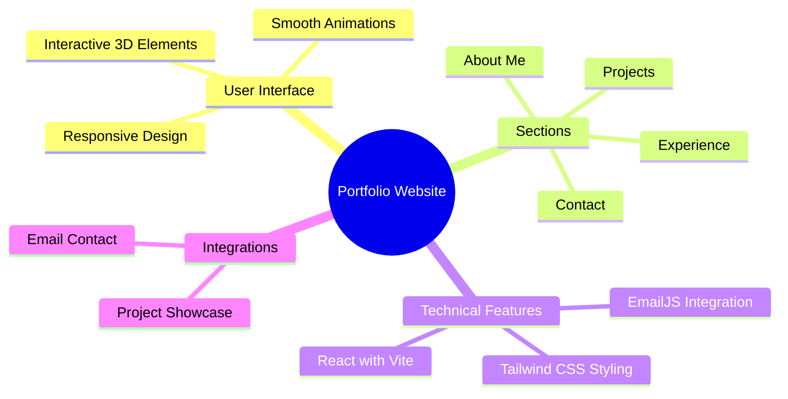

<<<<<<< HEAD

 

A modern, responsive portfolio website showcasing professional experience, projects, and skills. Built with React, Vite, and Tailwind CSS, featuring smooth animations and interactive 3D elements. ✨

## ✨ Features

## 🚀 Demo

Experience the live portfolio at  https://sinsydev.github.io/my-portfolio/
 
 

MIT License © [Sinsydev](LICENSE)

=======
# my-portfolio
>>>>>>> 
